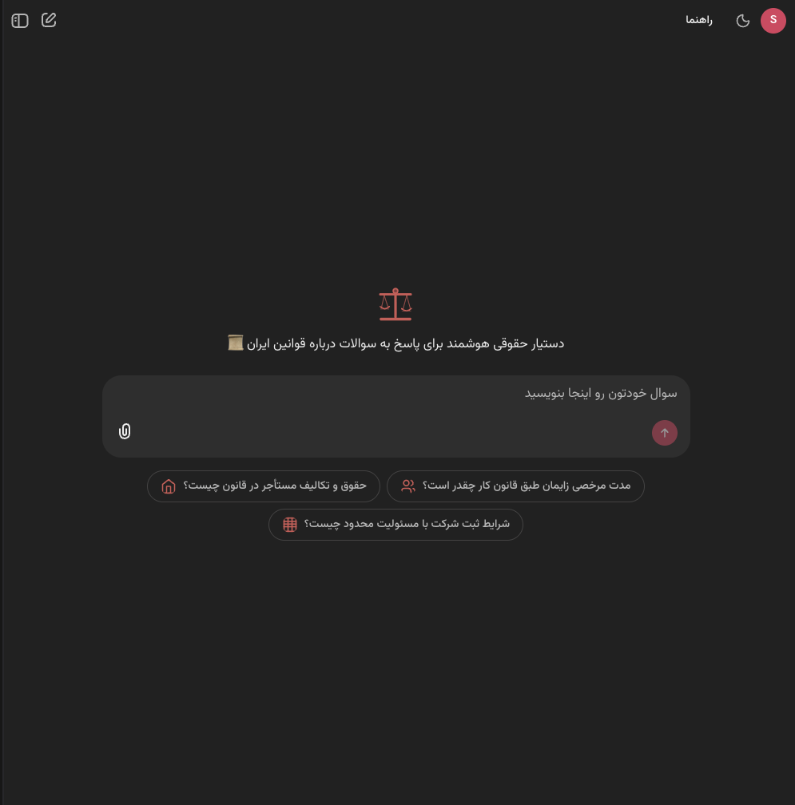

# Law Assistant — AI Legal Assistant for Iranian Law

A toy project I built to practice full agentic development on a real problem. A lawyer friend asked me to build this for his clients — it took about 3 days of my time to complete. Customers can ask legal questions in Persian and get answers grounded in 47,000+ Iranian legal documents — laws, regulations, advisory opinions, court rulings, and unified precedents — with inline citations linked to the source documents.

> **Every line of code in this repo was written by [Claude Code](https://claude.ai/code) — I haven't read or written any of it myself.** The models used were Claude Sonnet 4.5 and Claude Haiku 4.5, both running with medium extended thinking enabled.

[](tests/)
[](https://www.python.org/)



---

## What It Does

Customers describe their legal situation in plain Persian and the assistant searches the document database, follows citation chains, and writes a clear answer with numbered references. Each citation links directly to the source document.

The agent has three tools and decides its own search strategy at each step:

| Tool | Purpose |
|---|---|
| `search_documents(query, tags, doc_types, limit)` | Full-text search on document summaries |
| `get_document(doc_id)` | Retrieve complete document content |
| `get_related_documents(doc_id, relation_types, limit)` | Traverse the citation graph |

---

## Quick Start

### Prerequisites

- Python 3.10+
- PostgreSQL 14+ with the migrated law database
- LLM API credentials (any OpenAI-compatible provider)
- `uv` package manager

### Development Setup

```bash
# 1. Install dependencies
uv pip install -e ".[dev]"

# 2. Configure environment
cp .env.example .env
# Edit .env: LLM_BASE_URL, LLM_AUTH_TOKEN, DB_PASSWORD, CHAINLIT_AUTH_SECRET

# 3. Verify tests pass
make test

# 4. Start the server
.venv/bin/chainlit run src/law_assistant/ui/app.py --port 7860 --headless
# App at http://localhost:7860
```

### Docker Compose

```bash
cp .env.example .env
# Edit .env: LLM_AUTH_TOKEN, LLM_BASE_URL, CHAINLIT_AUTH_SECRET

docker compose build && docker compose up -d

curl http://localhost:8000/health
# App: http://localhost:8000 | Phoenix: http://localhost:6006
```

Full production instructions: **[`docs/maintainer/deployment.md`](docs/maintainer/deployment.md)**

---

## Architecture

### Database

**`documents`** (47,434 rows): `doc_id`, `title`, `doc_type`, `date`, `summary`, `full_content`, `tags`, `search_vector`

**`relations`** (300,174 rows): `src_doc_id`, `dst_doc_id`, `relation_type` — directed citation graph

Document types: `law`, `regulation`, `advisory_opinion`, `court_ruling`, `unified_precedent`

### Stack

| Component | Technology |
|---|---|
| Agent | PydanticAI |
| LLM | GPT-4.1-mini via MetisAI (`https://api.metisai.ir/openai/v1`) |
| Database | PostgreSQL 14+ with `persian_custom` FTS config |
| ORM | SQLAlchemy 2.0 async |
| UI | Chainlit 2.11 (RTL, sidebar, steps, feedback) |
| Auth | Email + invite code, per-user rate limiting |
| Observability | Arize Phoenix (self-hosted Docker) |
| Config | Pydantic Settings + `config.yaml` |
| Logging | structlog |
| Deployment | Docker Compose |

---

## Development

```bash
make all         # format + lint + typecheck + test
make test        # pytest only
make format      # Black
make lint        # Ruff
make typecheck   # mypy
```

Developer guide: **[`docs/development/workflow.md`](docs/development/workflow.md)**

---

## Project Structure

```
src/law_assistant/
├── agent/          # LawAgent, tool wrappers
├── tools/          # search_documents, get_document, get_related_documents
├── database/       # SQLAlchemy models, connection pooling
├── data/           # LawAgentDataLayer (Chainlit conversation history)
├── ui/             # app.py (Chainlit handlers), citations.py, rate_limit.py
├── health.py       # /health and /ready endpoints
├── observability/  # Phoenix tracing and feedback
├── config/         # Settings (Pydantic)
└── prompts/        # system prompt, starter questions

tests/
├── unit/           # Pure Python, fast
├── ui/             # Chainlit handler behavior (mocked)
└── integration/    # Require running PostgreSQL

docs/
├── architecture/   # design.md, search.md, database.md
├── development/    # workflow.md, tasks.md
├── maintainer/     # deployment.md, learning.md
└── features/       # One folder per feature: plan.md + progress.md
```
